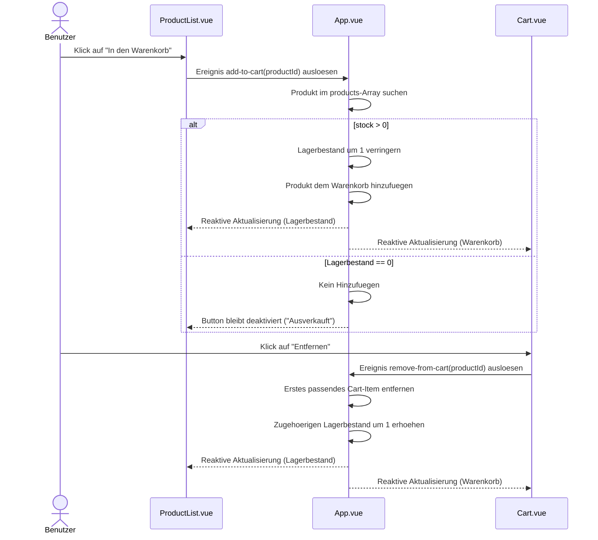

# Sequenzdiagramm: Erweiterter Web-Shop mit Lagerbestand

```mermaid
sequenceDiagram
    actor U as Benutzer
    participant PL as ProductList.vue
    participant A as App.vue
    participant C as Cart.vue

    U->>PL: Klick auf "In den Warenkorb"
    PL->>A: Ereignis add-to-cart(productId) ausloesen
    A->>A: Produkt im products-Array suchen

    alt stock > 0
        A->>A: Lagerbestand um 1 verringern
        A->>A: Produkt dem Warenkorb hinzufuegen
        A-->>PL: Reaktive Aktualisierung (Lagerbestand)
        A-->>C: Reaktive Aktualisierung (Warenkorb)
    else Lagerbestand == 0
        A->>A: Kein Hinzufuegen
        A-->>PL: Button bleibt deaktiviert ("Ausverkauft")
    end

    U->>C: Klick auf "Entfernen"
    C->>A: Ereignis remove-from-cart(productId) ausloesen
    A->>A: Erstes passendes Cart-Item entfernen
    A->>A: Zugehoerigen Lagerbestand um 1 erhoehen
    A-->>PL: Reaktive Aktualisierung (Lagerbestand)
    A-->>C: Reaktive Aktualisierung (Warenkorb)
```
