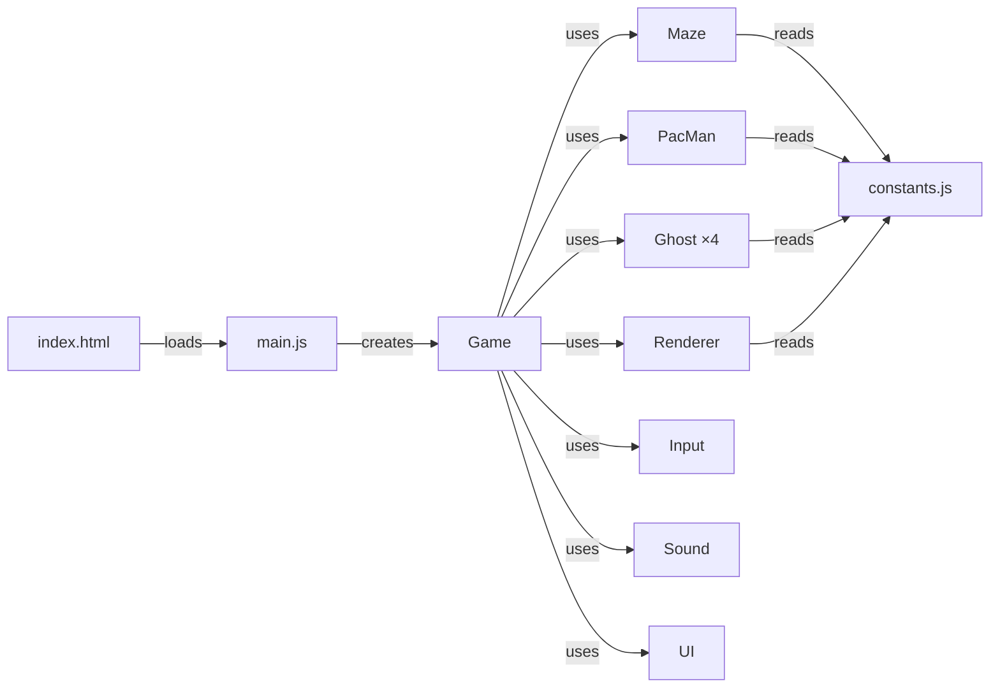
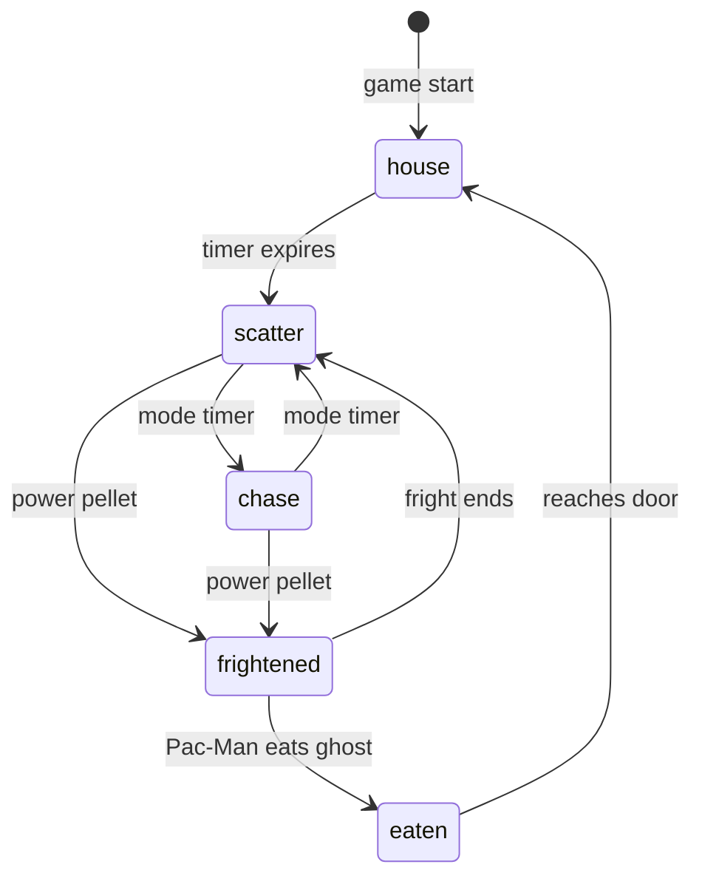

# 🟡 Pac-Man — Code Walkthrough

How every file works and how they fit together.

---

## Architecture at a Glance



**Data flows one direction:** `Input` captures key presses → `Game` reads them and updates `PacMan`/`Ghost` positions → `Renderer` draws everything on the canvas.

---

## 1. [index.html](file:///d:/Repos/PacMan/index.html) — The Page Shell

The entry point. It defines the **HTML structure** only — no game logic.

| Element | Purpose |
|---------|---------|
| `<canvas id="game-canvas">` | The single drawing surface for all game graphics |
| `#hud` | Score and high score at the top |
| `#hud-bottom` | Lives (mini Pac-Man icons) and level indicator at the bottom |
| `#start-screen` | Overlay: "PAC-MAN" title + "PRESS ENTER TO START" |
| `#game-over-screen` | Overlay: final score + "PLAY AGAIN" button |
| `<script type="module" src="js/main.js">` | Loads the game as ES module |

Also loads **Google Font "Press Start 2P"** (the classic arcade font) and `style.css`.

---

## 2. [style.css](file:///d:/Repos/PacMan/style.css) — Visual Theme

Pure CSS, no JavaScript. Key sections:

| Section | What it does |
|---------|-------------|
| **Reset & Body** | Black background with subtle radial gradient, centers everything |
| **Canvas styling** | `image-rendering: pixelated` keeps pixel art crisp when scaled, blue glow border |
| **HUD** | Yellow score text with glow (`text-shadow`), arcade font |
| **`.title-glow`** | Neon yellow/orange pulsing animation on the PAC-MAN title |
| **`.blink`** | Makes "PRESS ENTER" blink on/off via `step-end` animation |
| **`.glass-card`** | Game Over card uses `backdrop-filter: blur(20px)` for frosted glass effect |
| **Responsive** | `@media (max-width: 500px)` shrinks fonts for mobile |

---

## 3. [constants.js](file:///d:/Repos/PacMan/js/constants.js) — All Game Data

This is the **config file** — no logic, just values.

### The Maze Layout
```
TILE_SIZE = 16  (each tile is 16×16 pixels)
COLS = 28, ROWS = 31  (classic 28×31 grid)
```

`MAZE_LAYOUT` is a **2D array** — 31 rows × 28 columns. Each number means:

| Value | Constant | Meaning |
|-------|----------|---------|
| 0 | `EMPTY` | Walkable empty space |
| 1 | `WALL` | Blue wall (not walkable) |
| 2 | `PELLET` | Small dot (10 pts) |
| 3 | `POWER_PELLET` | Big pulsing dot (50 pts, frightens ghosts) |
| 4 | `GHOST_HOUSE` | Inside the ghost box (only ghosts) |
| 5 | `GHOST_DOOR` | The pink line at the top of the ghost box |
| 6 | `TUNNEL` | Wrap-around exits on row 14 |

### Other Config
- **`GHOST_CONFIG`** — each ghost's start position, scatter corner, and exit order
- **`LEVEL_SPEEDS`** — speed multipliers per level (ghosts get faster!)
- **`MODE_TIMINGS`** — how long scatter/chase phases last per level
- **`FRIGHT_DURATION`** — how long ghosts stay blue after a power pellet
- **`SCORE`** — point values (pellet=10, power=50, ghost chain=200→400→800→1600)

---

## 4. [maze.js](file:///d:/Repos/PacMan/js/maze.js) — Tile Queries

The `Maze` class wraps the 2D grid and provides **helper methods** so other modules never read the raw array directly.

| Method | What it does |
|--------|-------------|
| `reset()` | Deep-copies `MAZE_LAYOUT` (so we can eat pellets without modifying the original) and counts total pellets |
| `getTile(col, row)` | Returns tile type at position. Returns `WALL` for out-of-bounds (except tunnels) |
| `isWalkable(col, row)` | **For Pac-Man**: returns `true` if not wall/door/ghost house |
| `isGhostWalkable(col, row, canUseDoor)` | **For ghosts**: same but optionally allows door/house (for eaten ghosts returning home) |
| `eatPellet(col, row)` | Changes tile to EMPTY, decrements `pelletsRemaining`, returns points earned |
| `isTunnel(col, row)` | Checks if position is a tunnel tile (for wrap-around logic) |

---

## 5. [pacman.js](file:///d:/Repos/PacMan/js/pacman.js) — Player Entity

The `PacMan` class tracks position and handles movement.

### Key Properties
- **`col, row`** — current tile (integer grid position)
- **`x, y`** — pixel position (smooth movement between tiles)
- **`dir`** — current movement direction `{x, y}` e.g. `{x:-1, y:0}` = left
- **`nextDir`** — buffered input: the direction the player *wants* to go

### Movement Logic (`update(dt, maze)`)
The movement works in **3 steps** each frame:

1. **At tile center?** Check if Pac-Man is close to the center of the current tile
2. **Try buffered direction** — if the player pressed a key, try to turn that way. Only works if the next tile in that direction is walkable
3. **Move** — apply `speed × direction × deltaTime` to pixel position

**Wall collision**: before moving, checks if the next tile is a wall. If so, clamps position to tile center so Pac-Man stops cleanly.

**Tunnel wrapping**: if `x` goes past the left/right edge, it warps to the opposite side.

### Mouth Animation
A simple oscillating value (`mouthAngle`) that swings between `0.01` and `0.35` radians while moving. The renderer uses this to draw the pie-slice mouth.

---

## 6. [ghost.js](file:///d:/Repos/PacMan/js/ghost.js) — Ghost AI ⭐

The most complex module. Each ghost has a **personality** that determines its chase target.

### Ghost Modes


| Mode | Behavior |
|------|----------|
| `house` | Bobbing up/down inside the ghost box, waiting to exit |
| `scatter` | Heads toward its assigned corner (runs away from Pac-Man) |
| `chase` | Each ghost has unique targeting (see below) |
| `frightened` | Turns blue, moves randomly, can be eaten |
| `eaten` | Eyes only, races back to the ghost house |

### The Four Personalities (Chase Mode)

| Ghost | Color | Chase Target | Personality |
|-------|-------|-------------|-------------|
| **Blinky** | 🔴 Red | Pac-Man's exact tile | Direct chaser — always on your tail |
| **Pinky** | 🩷 Pink | 4 tiles *ahead* of Pac-Man | Ambusher — tries to cut you off |
| **Inky** | 🩵 Cyan | Complex: uses Blinky's position + 2 tiles ahead of Pac-Man, doubled | Flanker — unpredictable, depends on Blinky |
| **Clyde** | 🟠 Orange | Pac-Man if >8 tiles away, else his scatter corner | Shy — chases until close, then retreats |

### Movement: Simple Tile-to-Tile

```
1. Snap to tile center
2. Pick best direction (closest to target, no reversing)
3. Move toward next tile center
4. When crossing next center → arrived! Go back to step 1
```

The `_needsDecision` flag ensures direction is chosen **once per tile** — no oscillation.

**Direction priority**: Up > Left > Down > Right (matching the original arcade when distances are equal).

---

## 7. [renderer.js](file:///d:/Repos/PacMan/js/renderer.js) — Canvas Drawing

All visuals are drawn on a single `<canvas>` using the 2D context API. The canvas is `448×496` pixels but rendered at `2× scale` (896×992) for sharp visuals.

### What Gets Drawn Each Frame

| Method | Draws |
|--------|-------|
| `drawMaze(maze)` | Blue wall tiles with `shadowBlur` glow. Checks neighbours to extend walls into adjacent wall tiles for a connected look |
| `drawPellets(maze)` | Small circles (1.5px radius) for pellets, larger pulsing circles (4px) for power pellets |
| `drawPacman(pacman)` | Yellow `arc()` with a pie-slice mouth. Direction rotates the arc. `shadowBlur` adds glow |
| `drawGhost(ghost)` | Ghost body = dome top (`arc`) + wavy bottom (`quadraticCurveTo`). Eyes track movement direction. Blue face in frightened mode |
| `drawPacmanDying(pacman, progress)` | Death animation: mouth opens wider as `progress` goes 0→1 |
| `drawFruit(fruit)` | Colored circle with a green stem |
| `drawReadyText()` | "READY!" in yellow, centered below the ghost house |

### The Neon Glow Effect
Achieved with the canvas `shadowBlur` and `shadowColor` properties:
```javascript
ctx.shadowColor = '#4444FF';
ctx.shadowBlur = 6;
ctx.fillRect(x, y, w, h);  // wall tile — now has blue glow
ctx.shadowBlur = 0;         // reset for next draw
```

---

## 8. [game.js](file:///d:/Repos/PacMan/js/game.js) — The Brain 🧠

The central controller. Manages the **game loop** and **state machine**.

### State Machine

```
INTRO → (press Enter) → READY → (2s) → PLAYING → (die) → DYING → READY or GAME_OVER
                                    ↓                              ↑
                              (all pellets eaten) → LEVEL_DONE ───┘
```

### The Game Loop (`_loop(timestamp)`)

Called 60× per second via `requestAnimationFrame`. Each frame:

```
1. Calculate deltaTime (dt, capped at 50ms)
2. Clear canvas
3. Based on current state:
   - INTRO: just draw the maze
   - READY: draw maze + "READY!" text, count down timer
   - PLAYING: ← the main one (see below)
   - DYING: play death animation
   - LEVEL_DONE: flash maze walls white/blue
   - GAME_OVER: show overlay
```

### The PLAYING State (`_updatePlaying(dt)`)

This is where everything happens, in order:

```
1. Update scatter/chase mode timers
2. Update fright timer (flash ghosts near end)
3. Read player input → set Pac-Man's next direction
4. Update Pac-Man position
5. Update all 4 ghost positions
6. Check pellet collision → eat pellet, add score, play waka
7. Check power pellet → frighten all ghosts
8. Check fruit collision
9. Check ghost collision:
   - Ghost frightened? → eat ghost, add points (200→400→800→1600)
   - Ghost normal? → Pac-Man dies
10. Draw everything
```

### Scatter ↔ Chase Alternation
Ghosts alternate between scatter (go to corner) and chase (target Pac-Man) based on `MODE_TIMINGS`. Level 1: 7s scatter, 20s chase, 7s scatter, 20s chase... eventually permanent chase.

---

## 9. [input.js](file:///d:/Repos/PacMan/js/input.js) — Controls

Listens for **keyboard** and **touch** events, stores the last direction requested.

| Input | Maps to |
|-------|---------|
| Arrow keys / WASD | `DIR.UP / DOWN / LEFT / RIGHT` |
| Enter | Calls `onEnter` callback (starts game) |
| M | Calls `onMuteToggle` callback |
| Swipe (mobile) | Direction based on swipe angle |
| Tap (mobile) | Same as Enter |

**Direction buffering**: `consume()` returns and clears the stored direction. `game.js` calls this each frame — the direction applies once, then clears.

---

## 10. [sound.js](file:///d:/Repos/PacMan/js/sound.js) — Audio

All sounds are **synthesized** — no audio files needed. Uses the Web Audio API:

```
Oscillator (generates tone) → GainNode (controls volume) → Destination (speakers)
```

| Method | Sound | How |
|--------|-------|-----|
| `playIntro()` | Start jingle | 12 ascending sine notes |
| `playWaka()` | Pellet eating | Alternating 280Hz/350Hz, throttled to 120ms apart |
| `playEatGhost()` | Ghost eaten | 4 ascending chirps |
| `playDeath()` | Pac-Man dies | 8 descending tones |
| `startSiren()` | Background hum | Continuous low sine wave (60Hz, very quiet) |
| `toggleMute()` | Mute/unmute | Stops siren and blocks future sounds |

All tones use `sine` wave type at low volume (0.03-0.05) for a gentle, non-annoying sound.

---

## 11. [ui.js](file:///d:/Repos/PacMan/js/ui.js) — HUD & Overlays

Manages **DOM elements** (not canvas) for UI that sits outside the game canvas.

| Method | Does |
|--------|------|
| `updateScore(score)` | Updates score text, checks/saves high score to `localStorage` |
| `updateLives(lives)` | Creates mini Pac-Man `<canvas>` elements for each life |
| `updateLevel(level)` | Shows colored dots for current level |
| `showStartScreen()` / `hideStartScreen()` | Toggle the title overlay |
| `showGameOver(score)` / `hideGameOver()` | Toggle game over overlay with final score |

---

## 12. [main.js](file:///d:/Repos/PacMan/js/main.js) — Entry Point

Just 10 lines. Waits for DOM to load, grabs the canvas element, and creates a `new Game(canvas)`. The `Game` constructor wires everything together and starts the loop.

---

## How It All Connects

````carousel
### 🎮 Game Start Flow
```
1. Browser loads index.html
2. main.js runs → creates Game
3. Game creates: Maze, PacMan, 4 Ghosts, Renderer, Input, Sound, UI
4. Game.state = INTRO → draws maze behind start screen overlay
5. Player presses Enter → Input.onEnter fires
6. Game resets score/lives, starts READY state
7. After 2 seconds → PLAYING state begins
8. requestAnimationFrame loop runs at 60fps
```
<!-- slide -->
### 🔄 Each Frame (PLAYING state)
```
1. dt = time since last frame (typically ~16ms)
2. Read Input → set Pac-Man's buffered direction
3. PacMan.update(dt, maze) → moves Pac-Man
4. Ghost.update(dt, maze, pacman, ...) × 4
5. Check collisions: pellets, ghosts, fruit
6. Update score, lives, check game over
7. Renderer draws: maze → pellets → fruit → Pac-Man → ghosts
8. Repeat next frame
```
<!-- slide -->
### 💀 Death Flow
```
1. Ghost collision detected (non-frightened)
2. State → DYING, play death sound
3. Render death animation for 1.5 seconds
4. lives-- → if 0: GAME_OVER overlay
           → if >0: back to READY state
```
````
